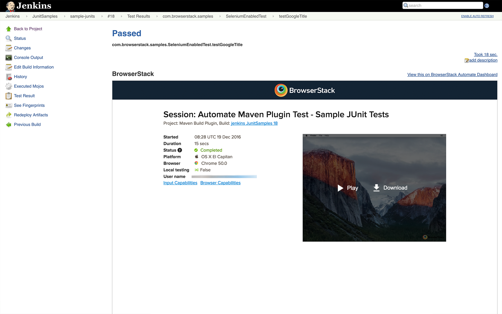
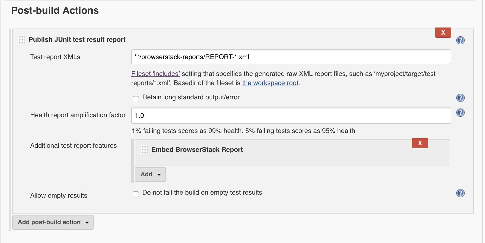

# protractor-browserstack-reporter

A Protractor plugin which enables BrowserStack reports on CI servers



## Installation

Add `protractor-browserstack-reporter` as a dependency in your `package.json`.

```json
{
  "dependencies": {
    "protractor-browserstack-reporter": "~0.1.0"
  }
}
```

## Configuration

Add `browserstack` as a plugin in your conf file.

```js
// conf.js
'plugins': [{
  'package': "protractor-browserstack-reporter"
}]
```

The following options are supported(optional):

### outputDir
Define a directory where your browserstack report files should get stored.

Type: `String`<br>

## Jenkins Setup

You will have to configure your Jenkins CI server to embed all the BrowserStack Selenium reports and logs in Jenkins.
  1. Click on Add post-build action in Post-build Actions.
  2. Click on Publish JUnit test result report
  3. In the Test report XMLs, enter */*browserstack-reports/REPORT-\*.xml
  4. In the Additional test report features section, add Embed BrowserStack Report.

This is how your configuration should look like


## Related links

[Guide to running Selenium Webdriver tests with Protractor on BrowserStack](https://www.browserstack.com/automate/protractor)

[Browserstack Jenkins page](https://www.browserstack.com/automate/jenkins)

[Protractor](https://www.protractortest.org).

